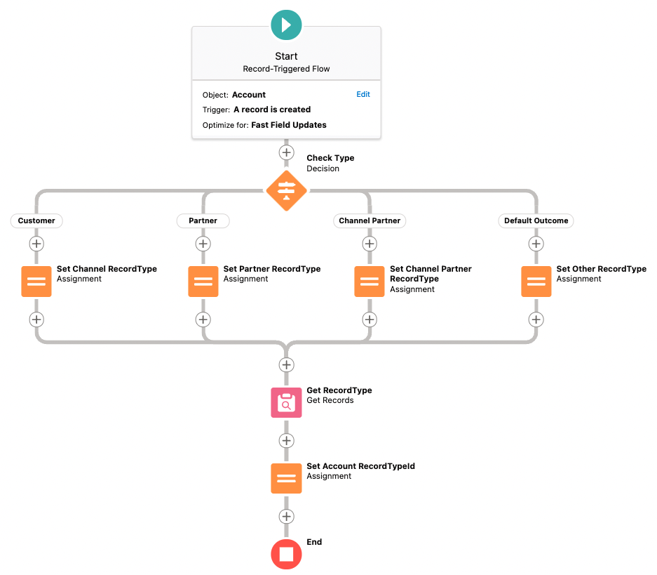
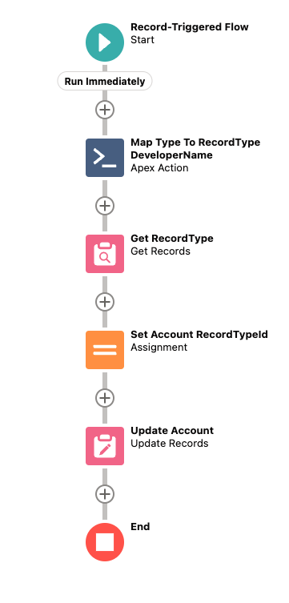
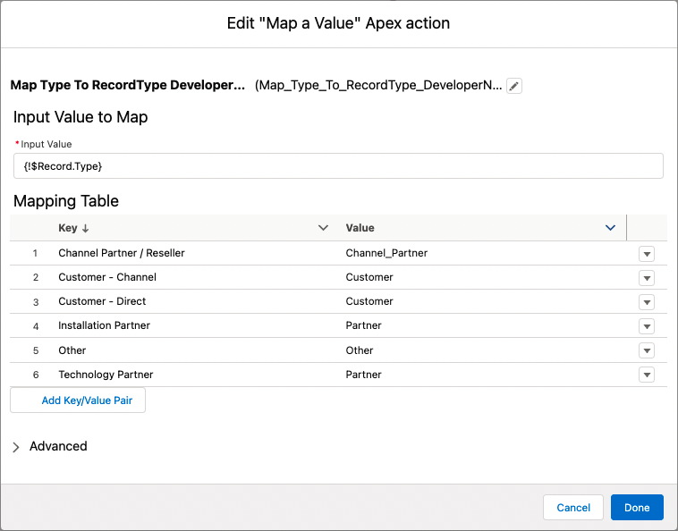
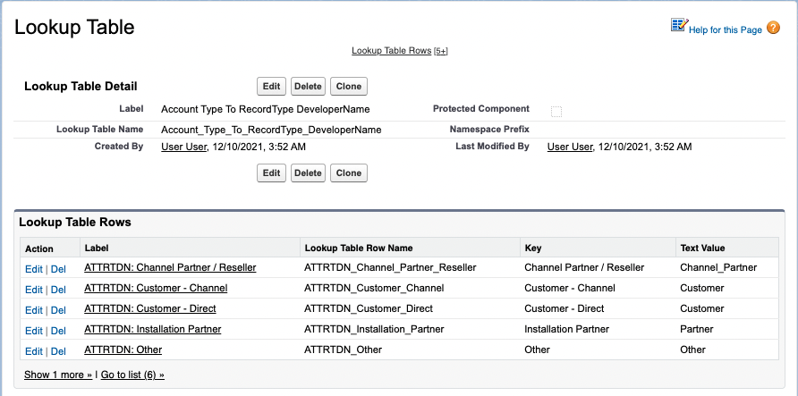
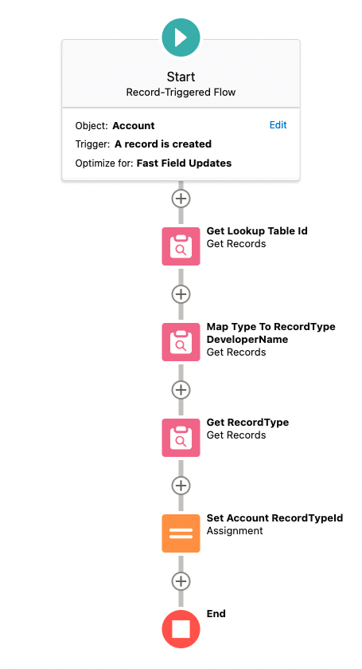

# "Map a Value" for Flow

Maps are a familiar data structure for Apex developers, but they also offer benefits in Flow. They can replace 
some many-branched decision nodes with a single node.

This scenario occurs in many places. For example, sending an email where the email template to use is based on the value of a
picklist field. Or assigning record ownership based on the value in a field. 

## A simple example: Account Record Type from Type

To demonstrate, we use a toy example of setting an Account's Record Type based on the Type 
(a standard picklist field on Account).

### Using a decision node

First, a conventional approach with a decision node:

As you would expect, this Flow checks `Type` in a decision node and assigns to a variable with the corresponding 
Account Record Type Developer Name. It then queries for the Record Type Id and assigns that onto the Account.

### Using a map node

That's fine, but it could be simplified with a Map:

In this version, the mapping from `Type` to the Record Type Developer Name is a single step. Let's take 
a look at the configuration of that magic "Map a Value" node:

The configuration needs two things:

* The name of the input variable
* A table of mapping data

It then outputs the mapped data. Simple and effective!

## An alternative: Custom Metadata Types

We can also leverage Flow's efficient queries in Get Records to store the mapping table in Custom Metadata records. This 
takes a few more nodes in the Flow, but doesn't need any custom code. It also externalises the mapping from the Flow, 
so the mappings could be modified without even opening the Flow.

### Custom Metadata Lookup Tables

We can define a Custom Metadata Type for a Lookup Table (another way of looking what a map does). Then, we can have 
another type to record the rows in that table. It's easy to see how this may work with an example:

It's useful to have this two-tier setup of records so that you don't get key-clashes if you adopted this approach 
across multiple Flows. e.g. Two Flows might be interested in the key "Important", to make sure they don't class, they 
are stored under different Look Table records.

### Custom Metadata Lookup Flow

It takes two queries here to do the mapping. First, we get the id of the Lookup Table (we can't currently query the rows 
based on the name of the parent). Then, we map the Account `Type` to the Record Type DeveloperName by querying the rows
of the Lookup Table. The rest of the Flow is the same as the others, loading the Record Type Id and assigning it.

### Evaluation

Using Custom Metadata takes more work to set up than mapping with the "Map a Value" action. However, bringing the 
configuration outside of the Flow might be useful for some circumstances.

## Example Flows

Example Flows using these techniques can be found in [examples](force-app/main/default/examples).

## Installation

The "Map a Value" action is not a package, it just an Apex Class, an LWC for configuration, and an Apex test. So, copy
the files in the following directories to your org:

* Apex: [FlowMap and FlowMapTest](force-app/main/default/apexFlowMap/classes)
* LWC: [flowMapEditor](force-app/main/default/apexFlowMap/lwc/flowMapEditor)

Similarly, the Custom Metadata solution can also be installed as individual files found in the [cmdtFlowMap](force-app/main/default/cmdtFlowMap)
directory.

## License
MIT, see [LICENSE](LICENSE)